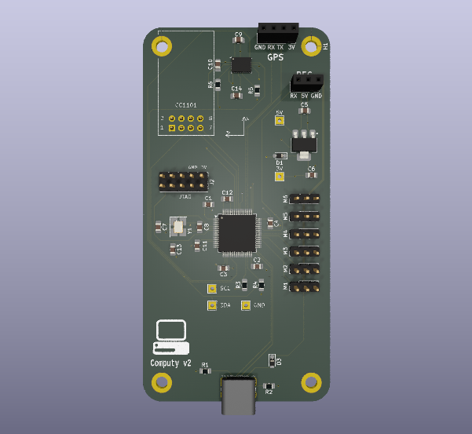

# Computy

An STM32 based flight computer

## Features

- **STM32F205 MCU**
- **BNO055 IMU** and **magnetometer**
- **GNSS** via UART
- **6 PWM** outputs for servos
- Receiver connection via UART
- **433MHz CC1101** telemetry radio

## Hardware

Board specifictions:
- **50mm x 100mm** board size
- Four **M3** mounting holes
- **25Mhz** external oscilator

KiCAD files can be found in `/PCB` directory.

## Firmware

MCU is programmed with CubeIDE. Full project is located in `firmware/Computy`.

### Dependencies

- **[stm32-nmea-gps-hal](https://github.com/sztvka/stm32-nmea-gps-hal)** (**modified** and **included**)

### Setup

Before you can build and upload the project to your Computy board, you have to create a `coordinates.h` header file in `firmware/Computy/Core/Inc` in which you have to define `TARGET_LAT` and `TARGET_LONG` variables.
Because the geolocation is sensitive, this file is included in `.gitignore` and is thus hidden.