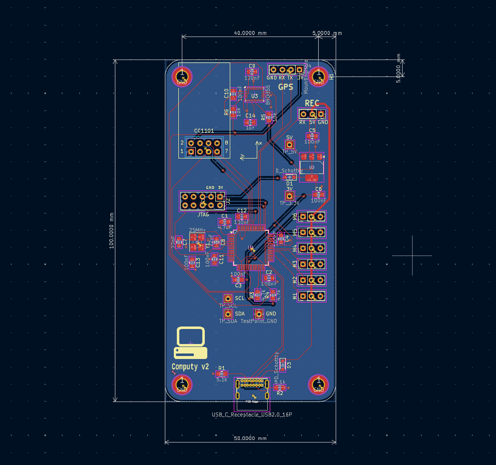

# Computy

An STM32 based flight computer

## Features

* **STM32F205 MCU**
* **BNO055 IMU** and magnetometer
* **GNSS** via UART
* **6 PWM** outputs for servos
* Receiver connection via **iBus**
* **433MHz radio** for telemetry

## Hardware

KiCAD files can be found in `/PCB` directory.

## Firmware

MCU is programmed with CubeIDE. Full project is located in `firmware/Computy`.

